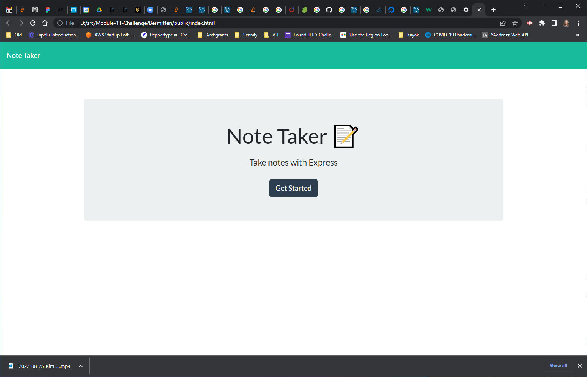

# Note Taker App
Module 11 Project. 
This Note Taker app writes and saves notes, deployed to Heroku.

## Technology used:
* Express.js
* Node.js
* HTML
* CSS
* Javascript
* Bootstrap
## Criteria
```
- GIVEN a note-taking application
- WHEN I open the Note Taker
- THEN I am presented with a landing page with a link to a notes page
- WHEN I click on the link to the notes page
- THEN I am presented with a page with existing notes listed in the left-hand column, plus empty fields to enter a new note title and the note’s text in the right-hand column
- WHEN I enter a new note title and the note’s text
- THEN a Save icon appears in the navigation at the top of the page
- WHEN I click on the Save icon
- THEN the new note I have entered is saved and appears in the left-hand column with the other existing notes
- WHEN I click on an existing note in the list in the left-hand column
- THEN that note appears in the right-hand column
- WHEN I click on the Write icon in the navigation at the top of the page
- THEN I am presented with empty fields to enter a new note title and the note’s text in the right-hand column
```


## Installation and Test Usage locally
1. Clone this code
2. In Visual Studio, run `npm i`
3. run `node server.js`
4. Click on `index.html` and run in default browser

## Deployed to Heroku

## Images
 

